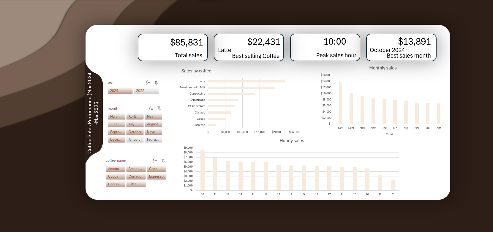

# MY Data Cleaning Steps for this dataset (a coffee dataset)
This dataset contains transactional coffee sales data across multiple product categories and time periods. It includes information such as product types (e.g., Americano, Cappuccino, Latte), sales revenue, and monthly performance.
The goal of working with this dataset was to explore patterns in sales performance, identify top-performing products, and understand trends over time.

Business Questions:
Which coffee products generate the highest revenue?
How do sales vary across different months?
Are there noticeable trends or seasonality in coffee sales?
Which products consistently perform well regardless of time period?
How does performance compare across different years?

Tools Used
Microsoft Excel
Data Cleaning (removal of duplicates, formatting)
Pivot Tables for aggregation and summarization
Calculated fields and helper columns where necessary
Dashboard creation using charts and slicers

*Dashboard Preview*

*****This dashboard provides an interactive view of coffee sales performance across products, time, and customer demand patterns.*****

Key Insights
From the analysis, several insights emerged:
Latte is the best-selling coffee and contributes the highest share of revenue.
Sales peak at 10:00 AM, indicating strong morning demand.
October 2024 recorded the highest monthly sales.
Some products, such as Espresso and Cocoa, generate relatively lower revenue.

Business Recommendations
Based on these insights, the business could:
Focus marketing and promotions on high-performing products like Latte.
Ensure adequate staffing and inventory during peak morning hours.
Investigate what drove strong October sales and replicate those strategies.
Introduce bundles or promotions to improve sales of low-performing products.
